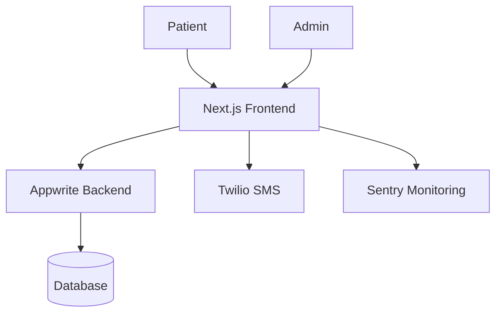

# 🏥 CarePulse

A modern **Healthcare Patient Management System** built with **Next.js**, **TypeScript**, **Appwrite**, and **Twilio**.

CarePulse streamlines the patient onboarding experience by allowing users to register, schedule appointments, and receive SMS notifications. It also provides an administrative dashboard for managing appointments and patient records in a secure, responsive web application.

> This project was developed for learning and portfolio purposes while exploring modern full-stack application architecture, backend services, and healthcare workflows.

---

## ✨ Features

### Patient Registration
- Create and manage patient profiles
- Collect personal and medical information
- Secure data validation

### Appointment Management
- Book appointments with doctors
- Select appointment date and time
- View appointment confirmation
- Appointment status tracking

### Admin Dashboard
- Secure administrator access
- View all appointments
- Confirm appointments
- Cancel appointments
- Reschedule appointments

### Notifications
- SMS appointment confirmations
- Appointment reminders
- Status updates using Twilio

### Monitoring
- Error tracking with Sentry
- Runtime monitoring
- Exception reporting

---

# 🚀 Tech Stack

## Frontend

- Next.js (App Router)
- React
- TypeScript
- Tailwind CSS
- shadcn/ui
- React Hook Form
- Zod

## Backend

- Appwrite
  - Database
  - Authentication
  - Storage

## Notifications

- Twilio SMS API

## Monitoring

- Sentry

## Deployment

- Vercel

---

# 📁 Project Structure

```text
app/
components/
lib/
constants/
types/
hooks/
public/
```

---


# 🏗️ System Architecture



---

# 📸 Screenshots

| Home | Registration |
|------|--------------|
| Add Screenshot | Add Screenshot |

| Appointment | Admin Dashboard |
|-------------|-----------------|
| Add Screenshot | Add Screenshot |

---

# 📚 What I Learned

This project provided hands-on experience with:

- Building production-style applications using Next.js App Router
- Creating complex multi-step forms
- Schema validation with Zod
- Backend-as-a-Service using Appwrite
- Healthcare appointment workflows
- SMS integration with Twilio
- Error monitoring using Sentry
- Responsive UI development
- Organizing scalable project architecture

---

# 🔮 Future Improvements

- Authentication with role-based access
- Doctor availability calendar
- Patient portal
- Medical history timeline
- Email notifications
- Search and filtering
- Pagination
- Analytics dashboard
- Unit and integration testing
- Docker support
- CI/CD with GitHub Actions

---

# 🙏 Acknowledgements

This project was developed as part of my exploration of modern full-stack web development and healthcare management systems.

The initial implementation was inspired by the excellent tutorial **"Build and Deploy a Patient Management System with Next.js | Twilio, TypeScript, TailwindCSS"** by **JavaScript Mastery**. The project was recreated to gain practical experience with Next.js, Appwrite, Twilio, Sentry, and production-oriented application architecture. :contentReference[oaicite:1]{index=1}

---

# 📄 License

This project is intended for educational and portfolio purposes.